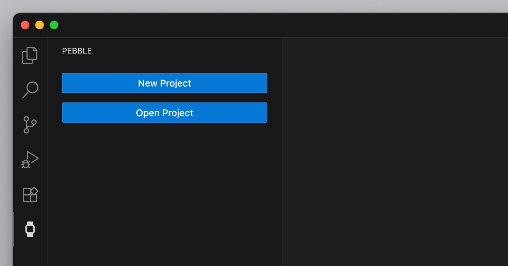
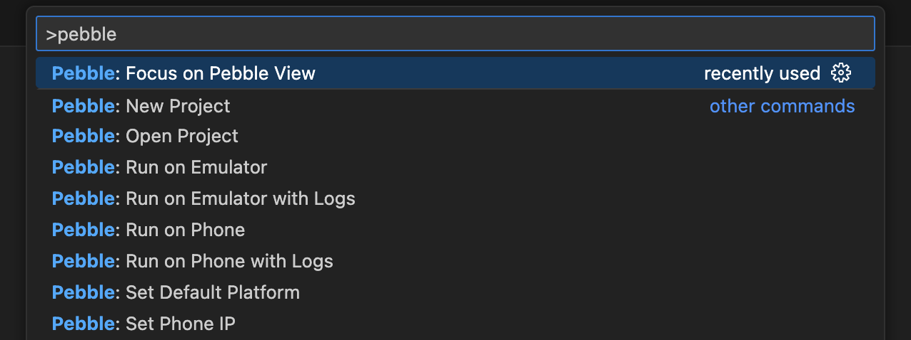

# Pebble VS Code Extension

This extension provides a development environment for Pebble apps and watchfaces. Rather than running commands using the `pebble` CLI, you can access those via buttons in the VSCode interface.

## Features

Run button at the top of each Pebble project file.

Run it on a phone or emulator, with or without logs.

Start a new watch app from the sidebar.

Terminal-style interface in the command bar.

Take any action from the VS Code command palette.

## Requirements

You'll need the `pebble` command-line tool installed. If you don't have it, check out the instructions in the Pebble SDK documentation.

## Extension Settings

This extension contributes the following settings:

* `pebble.defaultPlatform`: Set the default emulator platform.
* `pebble.phoneIp`: Set the default phone IP.